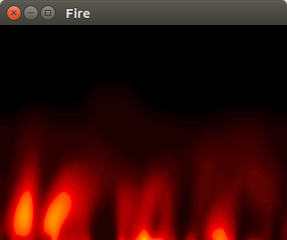
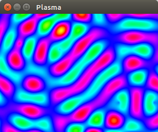
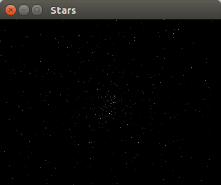
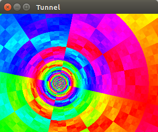

# Patater Demo Kit

A small collection of demos using SDL2

### How do I use?

[Install SDL2](https://wiki.libsdl.org/Installation) and build and run any of
the demos using the included Makefile.

If you just want to see what each demo does, they have all been built into
[WebAssembly](http://webassembly.org/) for running in your browser.

### Effects

Click any of the images below to see the effect in action.

